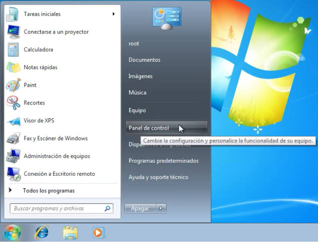

# proyectofinal_ia
proyecto final curso ia 

# Mi Proyecto de IA para 

Proyecto final para el curso Building AI

## Resumen

EcoRuta AI es un sistema de inteligencia artificial que analiza el tráfico en tiempo real, el clima y el peso de la carga para calcular la ruta de reparto más eficiente. El objetivo es reducir el consumo de combustible de las flotas de transporte en un 15%, disminuyendo así las emisiones de CO2.

## Antecedentes

El problema que resuelve es la ineficiencia logística en las ciudades. Actualmente, muchos camiones de reparto recorren rutas que no están optimizadas, lo que genera:
* Mayor gasto en combustible y mantenimiento.
* Retrasos en las entregas debido a atascos imprevistos.
* Aumento innecesario de la contaminación urbana.

Mi motivación personal surge al ver cómo el tráfico de reparto en mi ciudad ha aumentado drásticamente, y creo que la IA puede ser una herramienta clave para hacerlo más sostenible.

## ¿Cómo se usa?

El sistema está diseñado para gerentes de logística y conductores de reparto. El flujo es el siguiente:
1. El gerente sube la lista de entregas del día a la plataforma web.
2. La IA procesa los datos y genera la ruta óptima para cada vehículo.
3. El conductor recibe la ruta en una app móvil y la sigue.

Aquí una imagen de cómo se vería el panel de control:


Ejemplo de código para calcular la distancia total de una ruta:

```python
def calcular_distancia_total(ruta):
    distancia = 0
    for i in range(len(ruta) - 1):
        distancia += distancia_entre_puntos(ruta[i], ruta[i+1])
    return distancia

# Ejemplo de uso
ruta_optima = [(40.7128, -74.0060), (40.7306, -73.9352), (40.7580, -73.9855)]
print(f"Distancia total: {calcular_distancia_total(ruta_optima)} km")
